### `oliver@boulder:~$ whoami`

<table>
  <tr>
    <td width="43%" valign="top">
      
    </td>
    <td width="57%" valign="top">
      
    </td>
  </tr>
</table>

### `oliver@boulder:~$ ./links.sh`

[Website](https://oliver-browne.vercel.app/) · [LinkedIn](https://www.linkedin.com/in/olibrowne/)

### `oliver@boulder:~$ ./contributions.sh`

### `oliver@boulder:~$ ls projects/`

- [Embedded Final Project](https://github.com/oliBrowne/EmbeddedFinalProject)
- [Semantic Catching Layer for LLM APIs](https://github.com/oliBrowne/Semantic-Catching-Layer-For-LLM-APIs)

About me &amp; how this profile works

I'm **Oliver Browne**, a Computer Engineering student at **CU Boulder**, based in Boulder, Colorado. I'm interested in renewable energy, gaming, running, and coding. My repositories include work in **C, C++, and TypeScript**.

The portrait and info card are SVGs generated from local assets and `profile.json`. GitHub Actions refreshes the contribution calendar every day. See [SETUP.md](SETUP.md) for editing and refresh commands.

Inspired by Avi Vashishta's [animated GitHub profile README tutorial](https://www.avivashishta.com/blog/build-animated-github-profile-readme).

